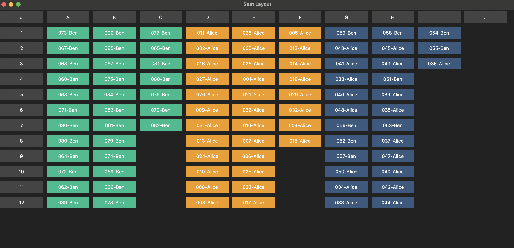

# IB Exam Seating Chart Generator

A local Python desktop application that generates exam seating charts from student registration data.

This tool automates the process of organizing exam seating layouts (e.g., IB-style exams) using a snaking algorithm and a graphical user interface.

---



## Overview

The application allows users to:

* Import student exam registration data from a CSV file
* Store and manage the data in a local SQLite database
* Define exam information (subject, paper, level, duration)
* Select a session and up to three subjects
* Generate a seating chart automatically
* Display a color-coded seating layout based on subject grouping

---

## How It Works

1. A CSV file containing student exam registrations is imported.
2. The data is stored in a local SQLite database (`seating_chart.db`).
3. Exam information (subject, paper, level) is added manually.
4. The user selects:

   * A session (e.g., `2026 MAY`)
   * Up to three subjects
5. The application:

   * Filters students based on subject, level, and session
   * Arranges them using a snaking seating algorithm
   * Displays the seating chart in a grid format

---

## Project Structure

```
auto-seating-chart-main/
├── main.py
├── DBconnection.py
├── seating_chart.db
├── sample_subject_report.csv
└── archive/
```

* `main.py`: Main application and GUI logic
* `DBconnection.py`: Initializes the database and creates required tables
* `seating_chart.db`: Local SQLite database (created after setup)
* `sample_subject_report.csv`: Example dataset (fake data for testing)

---

## Setup Instructions

### 1. Install dependencies

```
pip install pandas ttkbootstrap
```

### 2. Initialize the database

Run the following once to create required tables:

```
python DBconnection.py
```

### 3. Run the application

```
python main.py
```

---

## CSV Format Requirements

The application requires the following columns in the CSV file:

* Subject
* Level
* Session
* Session number
* First name
* Last name

Example:

```
Subject,Level,Session,Session number,First name,Last name
COMPUTER SCIENCE,HL,2026 MAY,2605001,Alice,Smith
PHYSICS,SL,2026 MAY,2605002,Ben,Lee
ECONOMICS,HL,2026 MAY,2605003,Chloe,Tan
```

---

## Sample Dataset Notes

The included `sample_subject_report.csv` is a simplified dataset intended for demonstration purposes.

It only contains a limited set of subject-level combinations:

* PHYSICS SL
* PHYSICS HL
* ECONOMICS SL
* ECONOMICS HL
* COMPUTER SCIENCE HL

Because of this:

* Only these subject-level combinations will return results when generating seating charts
* Selecting a subject or level not present in the dataset will result in no students being displayed

---

## Important Notes

* Subject, Level, and Session must match exactly between the CSV data and user selections
* If no students appear in the seating chart:

  * Verify subject, level, and session selections
* The application uses only the last 3 digits of the Session number for display purposes

---

## Data Privacy

This repository does not include real student data.

* All names in the sample dataset are fictional
* Session numbers are generated and anonymized
* Sensitive fields have been removed

Users should not upload real student data to public repositories.

---

## Future Improvements

* Export seating charts to PDF or CSV
* Automatic database initialization from `main.py`
* Improved UI layout and scaling
* Input validation and duplicate handling
* Packaging as a standalone desktop application

---

## Author

Yuto Ii
